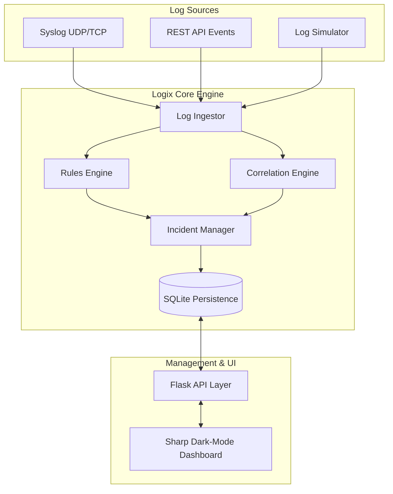

# Logix | Enterprise-Grade Behavioral SIEM Engine

[](https://opensource.org/licenses/MIT)
[](https://www.python.org/downloads/)
[]()

**Logix** is a high-density, real-time Security Information and Event Management (SIEM) platform designed for modern security operations. It combines the power of **Behavioral Detection**, **SIGMA Rule Correlation**, and **Stateful Incident Management** into a single, unified engine.

Built for security analysts who demand speed and clarity, Logix transforms massive streams of raw logs into high-fidelity actionable insights through a professional, data-centric interface inspired by top-tier tools like IBM QRadar and Microsoft Sentinel.

---

## 🚀 Key Capabilities

### 🧠 Advanced Detection Engine
*   **Behavioral Logic:** Modular Python-based rules for detecting complex multi-stage attacks (e.g., brute force, credential stuffing, suspicious child processes).
*   **SIGMA Support:** Native processing of industry-standard YAML SIGMA rules, enabling rapid deployment of community-sourced detection logic.
*   **Full-Text Log Explorer:** Powerful search capabilities across all ingested logs with granular filtering by source, entity, and event type.

### ⛓️ Stateful Correlation
*   **Sequence Tracking:** Detects patterns across multiple events over sliding windows (e.g., *Successful login followed by immediate sensitive file access*).
*   **Cross-Source Visibility:** Correlates disparate log sources (Syslog, API, Auth) into a single unified timeline.

### 🎖️ Incident Lifecycle Management
*   **Auto-Merge Triage:** Automatically groups related alerts into "Incidents" based on entity (IP/User) to reduce alert fatigue.
*   **Triage Workflow:** Track incident status from `New` → `In Progress` → `Resolved` → `Closed`.
*   **Entity Analysis:** Contextualized views for IPs and User accounts showing their complete security footprint and audit trail.

### 📡 Multi-Source Ingestion
*   **Syslog (UDP/TCP):** High-throughput ingestion support for network devices, servers, and IoT.
*   **REST API:** Simple JSON endpoints for application-level logging.
*   **Log Simulator:** Built-in generator for rapid testing and demonstration.

---

## 🏗️ Architecture



---

## 🛠️ Tech Stack

*   **Logic:** Python 3.10+, Flask
*   **Persistence:** SQLite (Optimized relational schema)
*   **Front-End:** Modern Vanilla CSS (Sharp/Corporate design), JavaScript (ES6+), Chart.js
*   **Standards:** SIGMA (YAML), MITRE ATT&CK Framework
*   **Deployment:** Docker-ready, optimized for CasaOS and enterprise environments

---

## ⚙️ Professional Setup

### 1. Requirements
Ensure you have Python 3.10 or higher installed.

### 2. Installation
```bash
# Clone the repository
git clone https://github.com/N1ranjann/Logix.git
cd Logix

# Initialize virtual environment
python -m venv .venv
source .venv/bin/activate  # Windows: .venv\Scripts\activate

# Install dependencies
pip install -r requirements.txt
```

### 3. Launching the Engine
```bash
# Start the SIEM server
python app.py
```
The dashboard will be available at `http://localhost:5000`.

---

## 🛡️ Detection Capabilities (OOTB)

| Rule Name | Severity | Targeted Tactic | Description |
|-----------|----------|-----------------|-------------|
| **Brute Force** | High/Critical | Credential Access | Detects rapid authentication failures from single IPs. |
| **Suspicious Process** | High | Execution | Flags execution of shells (powershell, cmd) from web servers. |
| **Lateral Movement** | Critical | Lateral Movement | Correlates auth success followed by immediate reconnaissance. |
| **Account Compromise**| Critical | Persistence | Tracks failure-to-success transitions for unique users. |

---

## 🤝 Contributing
Logix is built with modularity in mind. Security engineers can easily contribute new rules in `engine/rules/` or add correlation patterns in `engine/correlation.py`.

---

## 📄 License
This project is licensed under the MIT License - see the LICENSE file for details.

Developed with ❤️ for the Security Community.
